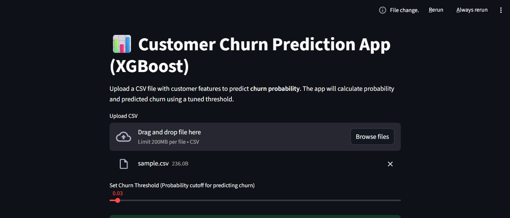
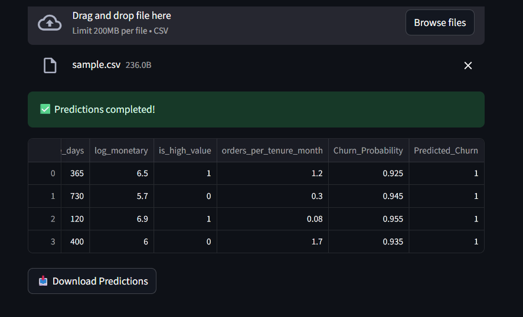

# Churn Prediction Project (Extreme Imbalance)

## Project Overview
This project aims to predict **customer churn** for a Brazilian E-Commerce company using machine learning. The main goal is to identify customers likely to leave (churn) and support decision-making for retention strategies.

We focus on handling **extremely imbalanced data**, preprocessing features, training machine learning models, evaluating them with appropriate metrics, and providing an interactive **Streamlit app** for predictions.

---

## Dataset
- **Source:** Brazilian E-Commerce dataset (public dataset / company-provided sample).  
- **Churn Label Distribution:**
  - `1 (churn)` → 99.64% of samples  
  - `0 (non-churn)` → 0.36% of samples  
- **Features:**  
  Includes numeric and categorical features such as purchase history, frequency, order value, last login, and engagement metrics.

- **Challenges:** Extreme class imbalance made it difficult to train models that detect minority class effectively.

---

## Challenges Faced
1. **Extreme imbalance**:
   - Original distribution had almost no non-churn samples.
   - Models trained on original data failed to detect minority class.

2. **SMOTE oversampling**:
   - SMOTE was used to balance the training set.
   - Generated synthetic minority examples to train models.
   - However, pure SMOTE caused **overfitting**, making models perform poorly on real minority samples in the test set.

3. **Model performance issues**:
   - RandomForest and XGBoost showed:
     - High accuracy (misleading due to imbalance)
     - Very poor recall/F1 for minority class
     - ROC-AUC around 0.55–0.56
   - XGBoost sometimes predicted **all samples as churn**, giving warnings for precision of class 0.

4. **Solutions implemented**:
   - Used **class-weighted models** and **SMOTE + Tomek links** for balanced training.  
   - Focused on **minority-class metrics**: recall, F1-score, confusion matrix.  
   - Threshold tuning for better detection of rare non-churn cases.  

---

## Models Used
- **RandomForestClassifier** with `class_weight='balanced'`  
- **XGBoostClassifier** with `scale_pos_weight`  

Saved models:
- `models/churn_xgb_pipeline.joblib` → Trained XGBoost pipeline  
- `models/churn_feature_cols.joblib` → Feature list for inference  

---

## Preprocessing Pipeline
1. Split dataset into **train/test**, preserving original distribution in the test set.  
2. Standard scaling for numerical features.  
3. One-hot encoding for categorical features (if any).  
4. Sampling:
   - **SMOTE + Tomek links** for minority oversampling and noise removal.  
5. Model training with **class-weighted settings**.  
6. Threshold tuning for minority-class detection.

---

## Evaluation Metrics
- **Confusion Matrix** – shows true/false predictions for each class  
- **F1-score / Recall** – for minority class (`0`)  
- **ROC-AUC / PR-AUC** – overall model quality, but not primary for rare class  
- **Accuracy** – misleading due to imbalance, not used as main metric  

---

## Streamlit App
We have built an **interactive Streamlit app** for easy churn prediction.

**Features:**
- Upload a CSV file with customer data.  
- Automatically selects the required features for prediction.  
- Calculates **churn probability** using the trained XGBoost model.  
- Applies a **tunable threshold** to classify each customer as `Churn` or `Not Churn`.  
- Displays predictions in the app and allows downloading a CSV file with results.  
- Shows a summary of predicted churn counts and a simple bar chart.

**Screenshot of the app:**




**How to Run:**
1. Ensure `models/churn_xgb_pipeline.joblib` and `models/churn_feature_cols.joblib` are in the same folder as `app/app.py`.
2. Install dependencies:
```bash
pip install streamlit pandas numpy scikit-learn xgboost joblib
